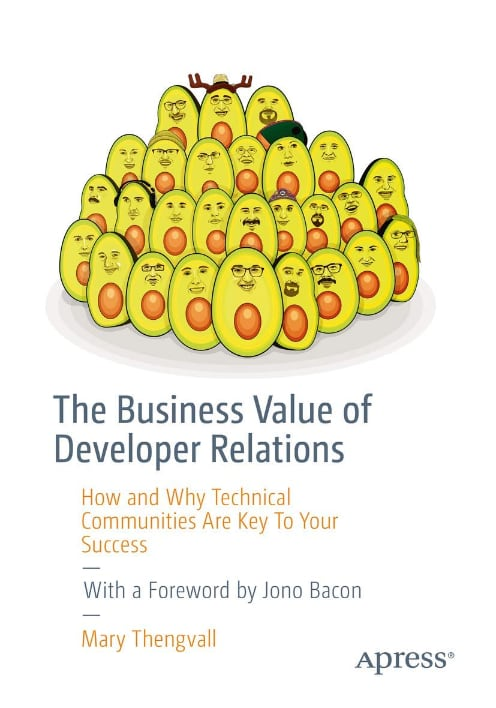

---?image=assets/images/coffee.gif&size=auto 80%
@title[Introduction]
@snap[south]
## DevRel @fa[hand-o-up]
@snapend

---
## 2008 - 2010

---?image=assets/images/coffee_title.jpg&size=auto
### So what does this have to do with DevRel?

---?image=assets/images/whatisdevrel.jpg&size=auto
@title[What is DevRel]
### So what is @color[#F39C12]("DevRel")?

---
#### @color[#F39C12](Dev)eloper + @color[#F39C12](Rel)ations

---
#### @color[#F39C12](Relations)(hips) with @color[#F39C12](Developer)(s)

---
@snap[west span-40]

@snapend
@snap[east span-40]
@quote[build relationships with the developer community](Mary Thengvall)
@snapend

---
@title[How does Coffee Relate to DevRel?]
## How does Coffee Relate to @color[#F39C12](DevRel)?

---
@title[Foundations of a good cup of coffee]
## Components of a Good Cup of Coffee
- Equipment
- Water
- Temperature
- Barista
- Beans

---?image=assets/images/coffee-equipment.jpg&size=auto
---?image=assets/images/coffee-water.jpg&size=auto
---?image=assets/images/coffee-temp.jpg&size=auto
---?image=assets/images/coffee-barista.jpg&size=auto
---?image=assets/images/coffee-beans.jpg&size=auto

---
@title[Foundations of a good DevRel program]
## Components of a Good @color[#F39C12](DevRel) Program
- Empathy (Advocacy)

---
@quote[Developers don't care what you know, until they know that you care.](Me)

---
@title[Foundations of a good DevRel program]
## Components of a Good @color[#F39C12](DevRel) Program
- Empathy (Advocacy)
-

---
@quote[To give real service you must add something which cannot be bought or measured with money, and that is sincerity and integrity.](Douglas Adams)
