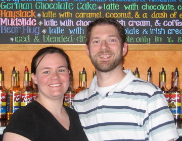

---?image=assets/images/coffee.gif&size=auto 80%
@title[Introduction]
@snap[south]
## DevRel @fa[hand-o-up]
@snapend

---?image=assets/images/whatisdevrel.jpg&size=auto
@title[What is DevRel]

---?image=assets/images/whatisdevrel.jpg&size=auto
### So what is @color[#F39C12]("DevRel")?

---
#### @color[#F39C12](Dev)eloper + @color[#F39C12](Rel)ations

---
#### @color[#F39C12](Relations)(hips) with @color[#F39C12](Developer)(s)

---?image=assets/images/devrel_book.jpg&position=left&size=60% auto
@snap[east span-25]
@quote[build relationships with the developer community](Mary Thengvall)
@snapend

---?image=assets/images/coffee_title.jpg&size=auto
### So what does this have to do with coffee?

---
## 2008 - 2010

---
@title[Components of a good coffee]
@snap[north-west span-25]
@box[bg-orange text-white rounded demo-box-pad](Equipment)
@snapend

@snap[north-east span-25]
@box[bg-orange text-white rounded demo-box-pad](Water)
@snapend

@snap[south-east span-25]
@box[bg-orange text-white rounded demo-box-pad](Temp)
@snapend

@snap[south-west span-25]
@box[bg-orange text-white rounded demo-box-pad](Barista)
@snapend

@snap[midpoint]
@box[bg-orange text-white rounded demo-box-pad](Coffee)
@snapend

---
## Components of a Good Cup of Coffee
- Equipment
- Water
- Temperature
- Barista
- Coffee
