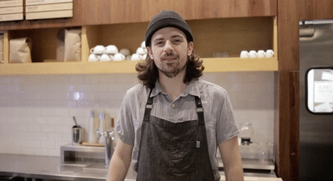

---?image=assets/images/coffee.gif&size=auto 80%
@title[Introduction]
@snap[south]
## DevRel @fa[hand-o-up]
@snapend

---
## 2008 - 2010

Note:
So the year is 2008. My wife and I have 3 kids, 2 full-time jobs, and we’ve just bought a coffee shop. No one ever said I was the smartest pea in the pod.

---?image=assets/images/271767211_2d1abac2bc_b.jpg

Note:
Over the next two years we rebuilt the shop from an exclusive, failing shop to a vibrant, inclusive, growing shop. We were educating people on the nectar of the gods, and helping them make the best choices they could with their coffee money. We began to build relationships, some of which continue to this day, and I learned a few things about “developer relations.”

---

Note:
See I had spent years as a developer, going back to the mid-80s with BASIC on the Atari 800XL, and I had spent years in communities, starting with BBS’s before I was 13. What I hadn’t really connected the dots with was what drove developers and communities, and what this thing was that would eventually be called Developer Relations.

---?image=assets/images/whatisdevrel.jpg&size=auto
@title[What is DevRel]
### What is @color[#F39C12]("DevRel")?

---
### February 3, 2000
#### @color[#F39C12](Dev)eloper + @color[#F39C12](Rel)ations

Note:
This term “Developer Relations” isn’t really all that new in terms of Technology roles / lingo, with it first appearing in Google results on February 3, 2000. Defining it, however, is an exercise in “he said/she said/they said” with numerous definitions and processes and misunderstandings in abundance. For the purposes of what I am relating here (SWIDT?) I will define it as:

---
#### @color[#F39C12](Relations)(hips) with @color[#F39C12](Developer)(s)

Note:
Eloquent, right? I mean, I didn’t skip college for nothin’! (Not exactly true, but not the subject of this diatribe.) Ok, so let’s use a definition which is a bit more elegant from Mary Thengvall’s The Business Value of Developer Relations:

---
@quote[build relationships with the developer community](Mary Thengvall)

Note:

Yeah — that’s a bit better. And what I really like about this one (as opposed to my terrible attempt at a lame joke), is that it encompasses so many activities (meetups, coffee with devs, conferences, community forums, etc.) which can roll up into how you “build relationships” without saying anything you have to do. Except build relationships with the developer community. That you must do. Got it?

---?image=assets/images/coffeedevshop.jpg&size=auto

Note:
The person we bought the shop from had started it 5 years prior as a way to engage with her daughter who, a few years after starting, moved away to college. That left the owner with an increasing malaise, decreasing motivation, and a general leaning to authoritarian-ly mother (it’s a word, and a real thing — trust me) all those who entered the shop.

<!--
---?image=assets/images/137054035_d65c0167da_o.jpg&size=auto
-->

---?image=assets/images/shameonyou.gif

Note:
- No outside food or drink (even if it was from a place that served what the shop didn’t, or wasn’t a competitor)
- If you were in the shop for more than an hour you must be ready to show proof that you had bought something or else you might be asked to leave (literally… she would walk around the store and randomly ask people to show their receipt)
- No loitering

See, what had happened was that an environment had been created where no one felt welcome, unless you were part of her inner circle. There were all sorts of rules (many unwritten) which needed to be followed before you could hope to be welcomed — and often that was a steep path where most just bailed.

---
@quote[Ruthlessly eliminate any barrier that keeps you from building a relationship with your target audience, and them with you](me)

Note:
Which brings me to a principle of successful DevRel programs...
That may require you to revamp your onboarding, or to revise your messaging, or make your free tier a bit more usable, or to revamp your website, or even to revamp your target audience — but whatever it is, ruthlessly eliminate it. Like yesterday. But maybe have a cup of coffee first? I’m sure those around you might benefit from it just as much as you.

---?image=assets/images/coffee_title.jpg&size=auto
### What does this have to do with DevRel?

Note:
Glad you asked. 

---?image=assets/images/coffeeshop.jpg&size=auto

Note:
Imagine you walk into your local coffee shop (and to be clear, I mean a locally-owned, independent shop that isn’t Charbucks, Dunkin’ Donuts, etc — I didn’t say I wasn’t biased) — what do you see? What do you smell? What do you hear? If they’re doing things correctly, you’ll see crowds of people around tables working, talking or reading; 

---?image=assets/images/coffee-environment.jpg&size=auto

Note:
you’ll smell freshly ground coffee; you’ll hear the whirr of the grinders, the chirping of (correct) milk steaming, the hum of music from some eclectic (and if you’re lucky, good) alternative band. What is it about all of that which stands out? 

---?image=assets/images/coffee-pourover-environment.jpg&size=auto

Note:
It’s the environment. It’s interacting with multiple senses at the same time. It’s starting to prepare you for what will (hopefully) be a wonderful time. Why should that be any different from DevRel?

---?image=assets/images/coffeeshop-environment.jpg&size=auto

Note:
The answer is of course that it shouldn’t. The same way you create a positive environment in a coffee shop, you do with DevRel. DevRel exists to build relationships with developers and if you’re not doing that, you don’t exist (or someone else will come along and do it for you).

---?image=assets/images/workingtogether.jpg&size=auto

Note:
Think about the coffee shop as your DevRel program, the baristas as the team, the coffee as your product(s), the espresso machine as your tools, and so on. Each of those working (or not) together can influence the perception of your company, just as a good/bad cup of coffee can make/break your coffee shop.

---

@emoji[em-coffee]
@fa[mug-hot fragment]

---

Note:
Early in our adventure, I started to notice a phrase that many customers who were new to the shop would respond with when presented with the typically monolithic coffee shop menu... It would start with a confused, almost glassy-eyed expression in response to the question of what the staff could get for them — and then after a few moments they would utter the following phrase...

---

@quote[Um, I'll just have a cup of coffee...](Befuddled coffee shop patron)

Note:
Now we were of course a coffee shop, so it made sense that they would want a cup of coffee. But what was a consistent indicator as you would watch their experience, was “I’ll just have….” That phrase was often a resignation to the plethora of information they were being assaulted with, and instead of engaging with that menu and the barista and identifying something to order, they would settle for a cup of coffee.

---?image=assets/images/coffee_pourover.jpg&size=auto

Note:
After hearing that a number of times I started to come back to them with questions to break through their overwhelmed state. I would ask things like “What are you in the mood for?” or “What do you normally order?” It was in those answers that I often got to the bottom of what they really wanted, and was able to provide them with an experience that usually moved them to become a regular customer and enjoy their chosen product more thoroughly. Other times, they would stick with “just a cup of coffee” and I would still engage with them to then identify what type of coffee they typically order — and that’s where my passion would start to come out.

---?image=assets/images/coffee_beans_snob.jpg&size=auto
## “Coffee snob? Who, me?”

Note:
See, a few years ago I finally came to grips with the fact that I am a coffee snob (I know, I know — I’m a bit thick-headed and it shouldn’t have come as a surprise). My first foray into coffee was when I was 12 at the car dealership my father worked at, and that was only as a way to stay warm as the coffee was nothing more than sludge, requiring copious amounts of milk and sugar to make it moderately palatable.

---?image=assets/images/starbucks.jpg&size=auto

Note:
It wasn’t really until my early 20’s that I gave coffee another chance via Charbucks as a friend of mine worked there. For all the problems with Charbucks (and if you don’t know — Starbucks is called that because they literally burn, or overroast, their coffee which brings out a heavily bitter taste requiring a metric f*T$ton of sweets to make it palatable), they were a step up from the sludge of my youth and what I was accustomed to. They were the gateway drug and opened a whole new world for me, so I guess they have a purpose. I found that I liked an Americano, which is just a couple shots of espresso and hot water — and that I could live with ordering that when my friends wanted to go to Charbucks.

---?image=assets/images/specialtycoffeeshop.jpg&size=auto

Note:
Not long after though, I began to frequent the independent shops in a search for a better cup of coffee, and that’s where I would say I truly fell in love with the nectar of the gods. I came in contact with a locally-roasted coffee which blew my mind: I didn’t need any milk to mask the bitterness, it wasn’t an Americano, and there were actual flavours I could taste! That unlocked a whole new world and I left Charbucks behind (and to this day I’ve probably only been there a handful of times in the last 15+ years).

---?image=assets/images/flavourwheel.jpg&size=auto

Note:
Coffee is supposed to have flavour, especially when it isn’t overroasted. Finding those flavours, or notes, during the “coffee cupping” activity is real, and not unlike how wine is tasted. There’s even a flavour wheel for identifying what it is you are tasting or smelling. I was smitten. I dove headfirst into learning, and tasting, everything I could about the Specialty Coffee industry. I went to coffee shops all over town, visited the top roaster in Kansas multiple times (who would eventually be the top in the US), and even competed in a barista competition. My wife and I even volunteered at, and then eventually took over as managers, our church’s coffee shop. All the while I kept learning and loving and embracing coffee — and when the opportunity to buy my favourite shop in our town was presented, I jumped at it.

---?image=assets/images/coffee_roasting-steam.gif&size=auth0
@title[How does Coffee Relate to DevRel?]
## So what does this have to do with @color[#F39C12](DevRel)?

Note:
This afore-mentioned passion served me well when I would engage with our customers and begin to educate them on what a good cup of coffee should be, and what they would likely enjoy. It wasn’t uncommon for me to convert someone who “required” their coffee be equal parts milk, sugar, and coffee into a straight, black coffee drinker — all because I found out what they were looking for, wanting, and even (for some people) needing by asking, listening, and building a relationship with them.

---
@quote[To give real service you must add something which cannot be bought or measured with money, and that is sincerity and integrity.](Douglas Adams)

Note:
Douglas Adams said it best... See, that’s DevRel to a “T” in my opinion. You have a product you are “evangelising”, and it requires that you actively listen, ask questions, build relationships with those developers using the product. It’s not always about pizza and beer (doesn’t hurt either), but it is about being intentional — it’s about being real. Developers can see through the marketing and sales bulls&*$ which so often is sent their way, and are willing to listen and try your product if/when they trust you. And that trust doesn’t happen immediately. In order to build that trust, your coffee shop (DevRel program) needs to be aligned in how you present and build relationships around your cup of coffee (product). And that’s where this “DevRel is like coffee” metaphor gets more interesting.

---
## So about this coffee/devrel metaphor?

Note:
As mentioned earlier, coffee is supposed to have flavour — and “char” is not a flavour. It’s a mental condition. It’s a resignation to not having nice things and instead settling. Don’t settle. Ever. So yes, coffee is supposed to have flavour — but in order to get there you must make sure certain components are in place and are working together (in no particular order) for coffee and devrel to be amazing:

---?image=assets/images/coffee-equipment.jpg&size=auto
@title[Foundations of a good cup of coffee-Equipment]
## @color[#F39C12](Equipment)

Note: 
Let’s face it — without good equipment, you can’t do much with anything. That doesn’t mean you need to spend your children’s college fund on coffee brewing equipment in order to achieve that perfect cup. Your Aeropress, french press, and pour-over brewing equipment are cheap alternatives (~$40) for single-cup brewing and work in concert with the rest of the components — but they require a bit more skill, precision, and patience to perfect than a normal brewer. But that doesn’t mean your regular drip coffee maker can’t make a good cup of coffee — it can — but it also won’t be the same as you could have from a coffee shop, for a number of factors that will be touched on below. 

---
@title[Foundations of a good DevRel program-Proper Tools]
## @color[#F39C12](Proper Tools)

Note:
Just as good equipment is an essential component for a good cup of coffee, so are the tools you use for yourselves and that you provide for your developer audience. Things like documentation, libraries, SDKs, etc. are essential pieces and you can’t neglect them. Developers may not like reading documentation, much less writing it, but they want to know that when they need you, you (and your tools) will be there. Your libraries and SDKs need to be thorough yet simple, and the least-technical person in the company should be able to run them, along with any tutorials you provide, without any issue.

---?image=assets/images/coffee-water.jpg&size=auto
@title[Foundations of a good cup of coffee-Water]
## @color[#F39C12](Water)

Note:
One could make the argument that nothing impacts a cup of coffee more than the water used, and they have a point. You can’t have a cup of coffee without it. You can certainly use tap water, with some cities having better than other’s. Unfiltered water carries all sorts of things which can affect the taste of your coffee. Because of this, I recommend using filtered water, either in bottle form or from a filter-system like your fridge might have. It may not be coffee shop level filtering, but it’s better than nothing.

---
@title[Foundations of a good DevRel program-Empathy]
## @color[#F39C12](Empathy, aka Advocacy)

Note:
Too often this word is missing from developer relations programs, and so let’s level-set what a good definition is. Merriam-Webster defines it as:

---
@quote[the action of understanding, being aware of, being sensitive to, and vicariously experiencing the feelings, thoughts, and experience of another of either the past or present without having the feelings, thoughts, and experience fully communicated in an objectively explicit manner](Merriam-Webster)

Note:
Wow. That’s a lot to unpack. As a member of a devrel team, being able to understand, be aware of, sense, and experience the feelings and experiences of the developers you’re trying to is essential — and I would suggest that there is no more important trait that a developer relations professional can have. 

---
@title[Foundations of a good DevRel program-Empathy]
## @color[#F39C12](Empathy, aka Advocacy)

Note:
Sure they should have technical chops, but that should be secondary or thirdary (it’s a thing I assure you) to empathy. They are to advocate for the developer / customer back to Product, Engineering, etc. and should have an acute understanding of all that they are experiencing. It is highly likely that the devrel team will come in contact with real users of the product exponentially more times than anyone else in the company — and as such it’s important they employ empathy. 

---
@quote[Developers don't care what you know, until they know that you care.](Me)

---?image=assets/images/coffee-temp.jpg&size=auto
@title[Foundations of a good cup of coffee-Temp]
## @color[#F39C12](Temp)

Note:
Consistency is essential when it comes to the brewing process, and fluctuations in water temperature can make a big impact. The ideal brewing temperature is between 195F and 205F (between 90C and 96C), with the reason being nifty science: too cool and under-extraction of the coffee occurs, while too hot and over-extraction occurs. There is really no normal consumer coffee brewer which can reach this during the brewing cycle, except for a few (one of which I linked above), with the normal brewer typically only reaching 156F, and the older your brewer the more likely that the temperature will continue to drop over time. You can help your consumer brewer out by using just-off-boiling water so that it doesn’t have to work too hard, or to ensure that you’re using as-close-as-possible hot water — but it won’t be as precise. That being said, the closest you can get to the correct temp, the better your coffee will be.

---
@title[Foundations of a good DevRel program-Community]
## @color[#F39C12](Community)

Note:
If you’ve spent any time around me you’ll know how passionate I am about community: how they’re formed, how they function, who’s in them, what makes them unique, etc. Developer communities are my passion. I love them. It’s why I finally made them a full-time career a few years ago instead of as just a hobby and obsession (not the stalker or alien kind of course). Those same communities are as unique as each coffee bean is, and need to be nurtured, listened to, and utilised to grow your reach and impact. That may come in the form of “superuser” or Ambassador programs, or in Office Hours, or via podcasts, User Days, etc. Don’t forsake the offline for the online either — it’s just as important. Make sure you’re present in your community, either personally or as a sponsorship of some sort at least.

---?image=assets/images/coffee-barista.jpg&size=auto
@title[Foundations of a good cup of coffee-Barista]
## @color[#F39C12](Barista)

Note:
The person making your cup of coffee, which could be you, is important — and you should tip them accordingly. With that out of the way, training is essential to making sure that the drink being made is done so with precision — but it doesn’t stop with one training session, it’s a continual process. I would often do spot-checks on my baristas to make sure they were doing things correctly — because the product we were producing depended on it. Our reputation depended on it. The word “barista” literally means “someone who prepares coffee.” I won’t go into my usual tirade about how being a button-pusher on an espresso machine doesn’t mean someone is a barista as they aren’t the entity preparing the coffee. Because that tirade delves deeply into emotion and you DON’T WANT ME TO GO THERE. Ok? Got it?

---
@title[Foundations of a good DevRel program-Team]
## @color[#F39C12](The Team)

Note:
In 2001, Jim Collins wrote a fantastic book on leadership entitled Good to Great, where he found that the key thing which separated good companies from great companies was this: they had the right people, on the right bus, in the right seats, going in the right direction. If you’re building a DevRel team, it’s important to know the roles you need, who’s going to fill them, what your goals are, and how you’re going to achieve them. As this isn’t a management post, I’ll not delve into that area of DevRel — but I do recommend you pick up Mary’s aforementioned book and pay attention to the section on roles and who you should be hiring.

---?image=assets/images/coffee-beans.jpg&size=auto
@title[Foundations of a good cup of coffee-Beans]
## @color[#F39C12](Beans)

Note:
The final component of a good cup of coffee is the beans. I mean, why go through all of the trouble to make sure the other things are top-notch, and then bomb it at the end with a crappy choice in beans? And let’s not forget that the roast of the beans matters as well. I’ve seen good quality beans ruined by being over-/under-roasted, and nothing makes sure an angel doesn’t get their wings than that! This plays into the “coffee has flavour” from above. The oils naturally found in the coffee bean are where the flavour comes from, and the roasting process brings them out. However, if you don’t get the right roast then the flavour won’t be fully realised, and in order to get the right roast it requires trial and error by the roaster. 

---?image=assets/images/coffee-scale.jpg&size=auto
## @color[#F39C12](Beans)

Note:
Once you have a good bean chosen, the next piece in the puzzle is the grind. This determines how well the coffee is extracted during the brewing process, and it’s important to make sure the grind is correct for how you’re brewing, with “coarse” meaning larger grounds, and “fine” meaning smaller grounds.

Extra-coarse: cold-brew coffee // Coarse: french press or Chemex // Medium: auto-drip coffee (“drip grind”) and pourover (“fine drip grind”) // Fine: espresso (“eh-spress-o”, not “EXXXXXpresso”)

---
@title[Foundations of a good DevRel program-Product]
## @color[#F39C12](Fresh Product)

Note:
The message you’re trying to convey about your product is one which may become stagnate or not hit the mark with the audience you’re targeting. That’s ok. It happens. But don’t let it stay there. Every talk you give, every piece of swag you give out should be customised to the event in question. 

---?image=assets/images/sticker_table.jpg&size=auto

Note:
That doesn’t mean you write something new each event — but it does mean that you might have to make some minor tweaks to speak on Authentication at GopherCon as well as VueConf, or have a set of t-shirts or stickers or socks for a Javascript conference and for a .Net conference. Be relevant. Because if your product isn’t, then you have a problem.

---

Note:
One company that does this really well I think is Algolia. They have stickers for just about everything, and they're customised to what segment of their product is being pushed.

---

---

Note:
Each one of these things could be a long diatribe in and of themselves, so I’ll save them for another time. But without all of these things working together, your DevRel efforts will be out of balance.

<!--

---

Note:
So now that I think we're all thoroughly thirsty for a cup of coffee, let's talk about something else for a bit.

---
## Quantifying DevRel

Note:
It's important to be able to quantify what you're doing to show if there is value for that event/initiative/etc. In DevRel that can be an exercise in getting familiar with "fuzzy metrics". How do you know if you're having an impact? How do you know if it was worth going to X conference or sending out those stickers? Btw: you can figure out the ROI of stickers, as evidenced by a talk my friend Matt Broberg gave at CLS17.

---?image=assets/images/sticker_roi.jpg&size=80%

Note:
You really can get an ROI on producing stickers. You can get an ROI on just about anything - but that doesn't mean you should.

---

Note:
In a talk that Steve Pousty gave at DevRelCon UK 2018, he touched on how ROI is a trap, and often whenever someone says "What's the ROI on that?" what they're really saying is "I think what you're saying is crap and not worth it." If you've spent any amount of time in any organization you've probably heard that question "What's the ROI on that?" and it's always used to force you to justify what it is you feel needs to happen to someone who doesn't. And if you've been in DevRel any amount of time, you know exactly when that question is coming. So in preparation for that question, it's good to know some data which we'll touch on real quickly.

---
@ul
- What's going well?
- What's not?
- What can we do differently?
@ulend

Note:
These data points are good spots to start, and help you understand how and what you can and/or should be measuring. You're going to get a variety of answers, some qualitative and some quantitative, and each will serve a specific purpose. My friend Matt Broberg refers to this as "measuring things with your brain vs going with your gut." So some things you'll be able to get a specific number for, like how many people signed up for a trial from your talk, or engagement numbers on social media. Other things will be a gut instinct based on conversations and observations based on interactions with the community like the sentiment around a specific library or tool or initiative.

-->