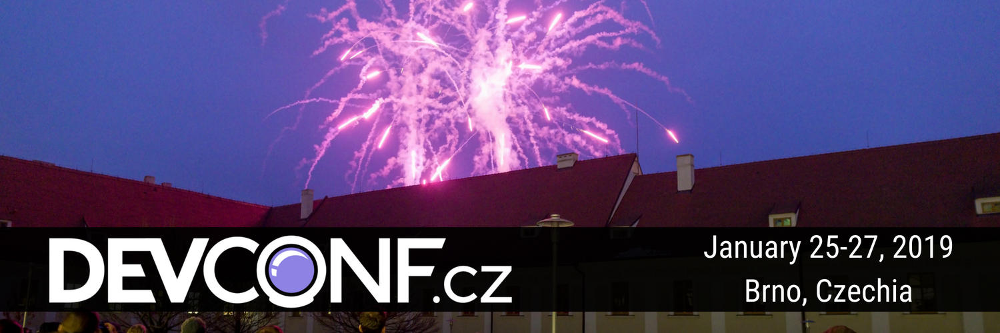

# DevConf.CZ 2019 - Jan 25-27, 2019
## Developer Communities are just like coffee shops
Developer communities should smell like freshly ground coffee, or taste like an amazing cup of coffee from the remote reaches of El Salvador. In this session we'll talk about what makes developer communities so unique, how you reach out to them and/or build them, and how to measure their viability and health.

### Presentation
[GitPitch](https://gitpitch.com/jerdog/talk-devrel-like-coffee/)  
[Slides](https://github.com/jerdog/talk-devrel-like-coffee/blob/devconfcz19/DevConfCZ2019_DevRel-is-like-coffee.pdf)

